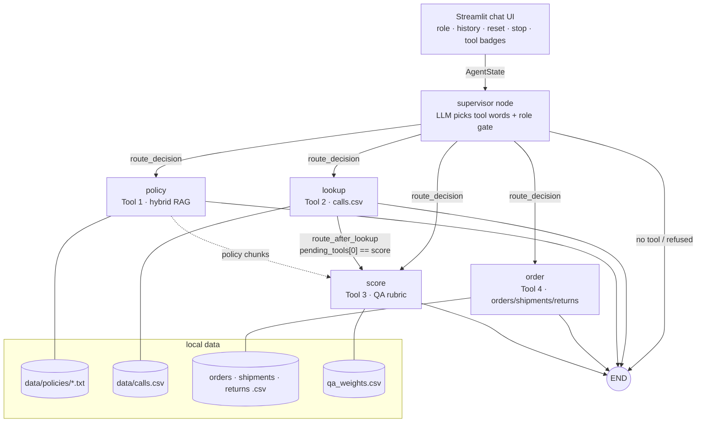
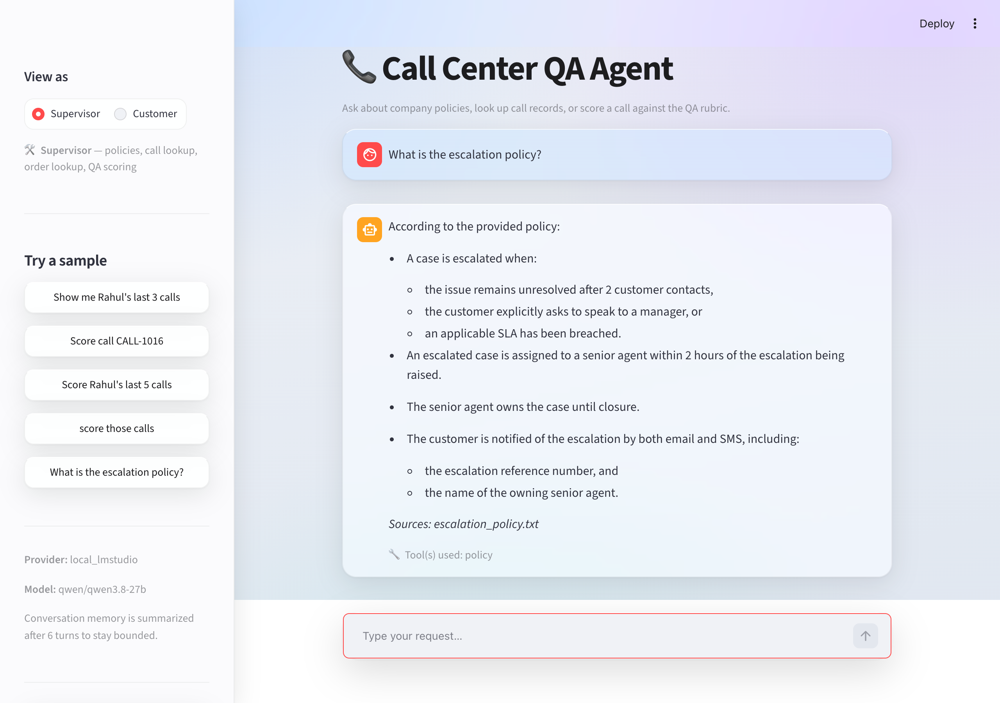
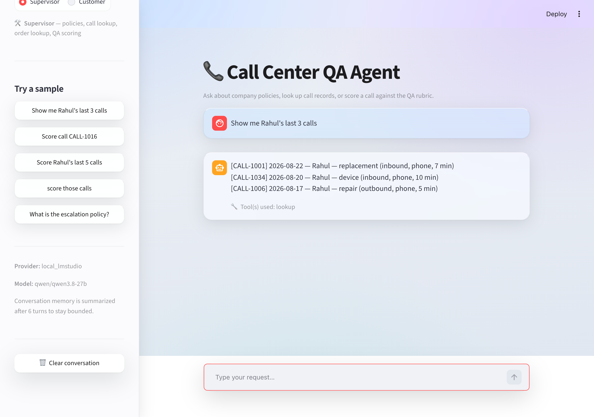
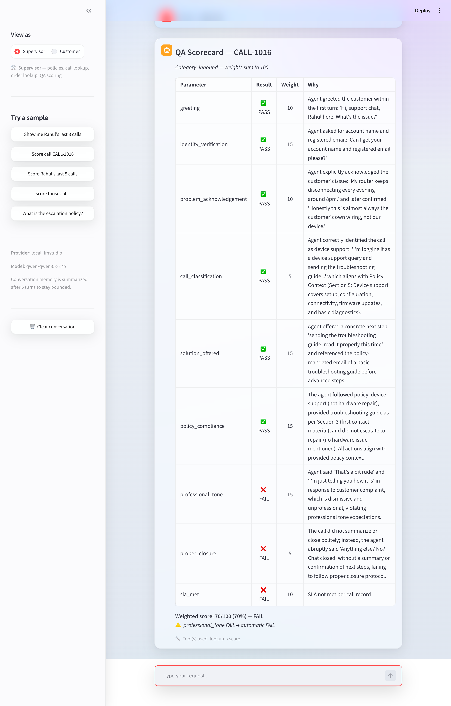
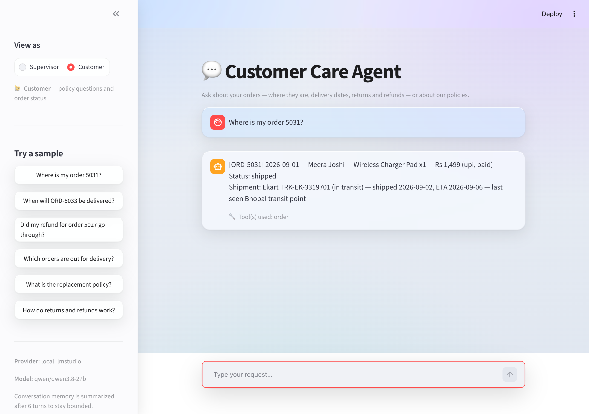
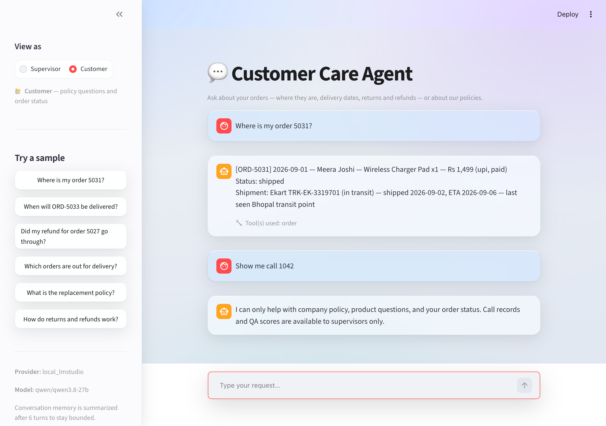

# Call Desk Agent — Call-Center QA & Customer-Care Agent

A conversational **LangGraph agent** with four local tools. A **supervisor** uses it to search
policy documents, look up call records, and score call transcripts against a weighted QA rubric;
a **customer** uses the same agent to ask policy questions and track their orders. Every policy
judgment is grounded in *retrieved* policy text (with sources cited) rather than the model's memory.

> IIT Patna USDC GenAI Development Program — Final Evaluation, **Project 3 (Agentic AI)**.
> All data is synthetic; all policies are fictional.

---

## 1. Problem statement

Call-center quality assurance is manual and slow. A reviewer has to pull a call record, read the
transcript, remember the relevant policy, and grade the agent against a rubric — for every call. It
doesn't scale, and "does this response actually match policy?" is exactly the judgment humans get
tired and inconsistent on. Meanwhile customers ask the same *where is my order / what's the return
policy* questions all day.

## 2. Solution overview

You type a natural-language request into a chat UI. A **supervisor LLM node** reads it, decides
which tool(s) it needs, and the graph routes to them — **chaining** where necessary (fetch a call,
then score it) in one turn. Each tool does one job over local CSV/TXT data:

| Tool | Node | What it does | Who may use it |
|---|---|---|---|
| **Policy Search** | `policy` | Hybrid RAG (FAISS + BM25) over 5 policy docs; answers only from retrieved chunks, cites sources | Supervisor, Customer |
| **Call Lookup** | `lookup` | Natural language → structured filters over `calls.csv` | Supervisor |
| **QA Scorer** | `score` | 9-parameter weighted rubric on a transcript; policy compliance checked against retrieved policy | Supervisor |
| **Order Lookup** | `order` | Order status / shipment tracking / refunds over `orders.csv` + `shipments.csv` + `returns.csv` | Supervisor, Customer |

The **role** (Supervisor / Customer) is part of the graph state and is enforced in the supervisor
node — a customer asking for call records is refused, not silently routed.

This is an **agent**, not a chatbot: the LLM decides *what to do*, real functions run, and the
answer comes from their results.

## 3. Architecture



A `StateGraph` (`src/agent/graph.py`) threads one shared `AgentState` (`src/agent/state.py`)
through a supervisor node and four tool nodes:

- **State** — `messages` (chat history, `add_messages` reducer), `role`, `call_records` (the calls
  currently in focus), `qa_scores`, `next_tool`, `pending_tools`, `tool_trace`.
- **Conditional routing** — `route_decision` reads the supervisor's first tool word; a second
  conditional edge after `lookup` (`route_after_lookup`) checks `pending_tools` — this is what lets
  *"Score Rahul's last 5 calls"* run **lookup → score** in a single turn.
- **Memory across turns** — the UI keeps the same `AgentState` for the whole session, so
  *"score them"* reuses the previous lookup's `call_records`. Once the chat runs long, older turns
  are compressed into a summary message.
- **Tool visibility** — every tool node appends a `tool_trace` entry (tool, data source, whether the
  LLM step degraded); the UI shows it under each answer.

### Tools

- **Tool 1 — Policy Search** (`src/tools/policy_search.py`): loads 5 policy `.txt` files, chunks
  them, and runs **hybrid retrieval** — a FAISS dense retriever (MiniLM embeddings) fused with a
  BM25 keyword retriever via `EnsembleRetriever` (reciprocal-rank fusion). A keyword router scopes
  the search to the relevant policy. FAISS indexes are persisted and rebuilt only when the corpus
  fingerprint changes. The LLM answers **only** from retrieved chunks and the answer cites the
  policy files used (`Sources: …`).
- **Tool 2 — Call Lookup** (`src/tools/call_lookup.py`): two-stage extraction, cheapest first.
  Stage 1 is a regex/enum prefilter (no LLM) that handles most queries; Stage 2 falls back to a
  structured-output LLM (`.with_structured_output(CallFilters)`, Pydantic + Enums) only for fuzzy
  dates. Regex-resolved fields always win on merge. Filtering is pandas over `data/calls.csv`.
- **Tool 3 — QA Scorer** (`src/tools/qa_scorer.py`): scores a transcript against **9 parameters**.
  Eight are LLM-judged via a Pydantic `QAResult` schema; the 9th, `sla_met`, is **deterministic** —
  read from the call record. The overall score is a **weighted** percentage (per-category weights
  from `data/qa_weights.csv`), computed in Python. `policy_compliance` is judged only from retrieved
  policy text and forced to FAIL if none is available; `professional_tone` is a **hard gate**.
- **Tool 4 — Order Lookup** (`src/tools/order_lookup.py`): a structural twin of Tool 2 over three
  left-joined tables (orders, shipments, returns). Answers *where is my order / when will it arrive /
  did my refund go through*.

## 4. Technology stack

| Component | Technology | Why |
|---|---|---|
| Agent framework | **LangGraph** (`StateGraph`, conditional edges) | State + routing + chaining as first-class, inspectable graph |
| LLM orchestration | **LangChain** (chat models, structured output) | Provider-agnostic; Pydantic-bound outputs |
| Retrieval | **FAISS + BM25** via `EnsembleRetriever` (RRF) | Hybrid beats dense-only on short, term-heavy policy text |
| Embeddings | `sentence-transformers/all-MiniLM-L6-v2` | Free, local |
| Structured output | **Pydantic** + `.with_structured_output()` | No JSON hand-parsing; Enums make bad values impossible |
| Data | CSV + TXT + pandas | No database setup |
| UI | **Streamlit** chat | Simple, local |
| LLM providers | Gemini / OpenAI / Anthropic / local LM Studio | Selected by `config.json` `active_provider` |
| Logging | Python `logging` (`LOG_LEVEL` env var) | One root config in `src/config.py` |
| Language | Python 3.14 | — |

## 5. Project structure

```
Call-Desk-Agent/
├── README.md
├── config.json              # single source of truth: providers, chunking, retrieval
├── requirements.txt
├── .env.example             # copy to .env; only the active provider's key is needed
├── src/
│   ├── config.py            # loads .env + config.json once; root logging config
│   ├── tools/
│   │   ├── policy_search.py # Tool 1 — hybrid RAG + source citations
│   │   ├── call_lookup.py   # Tool 2 — NL → filters over calls.csv
│   │   ├── qa_scorer.py     # Tool 3 — 9-param weighted QA rubric
│   │   └── order_lookup.py  # Tool 4 — NL → filters over orders/shipments/returns
│   ├── agent/
│   │   ├── state.py         # AgentState TypedDict
│   │   └── graph.py         # supervisor StateGraph (nodes, edges, routing, role gate)
│   ├── eval/
│   │   └── validate_scorer.py  # scorer accuracy vs. the dataset's answer key
│   └── ui/
│       └── app.py           # Streamlit chat UI (roles, memory, stop button, tool badges)
├── data/
│   ├── policies/*.txt       # 5 fictional policy docs (ground truth for the scorer)
│   ├── calls.csv            # 50 synthetic call records (33 good / 17 bad) + transcripts
│   ├── qa_weights.csv       # per-category rubric weights (each column sums to 100)
│   ├── orders.csv, shipments.csv, returns.csv   # 40 orders / 33 shipments / 8 returns
│   └── README_DATA.md       # data dictionary + bad-call answer key
├── docs/
│   ├── sample_outputs.md    # real captured agent outputs for each tool + a refused request
│   ├── screenshots/         # UI screenshots used in this README
│   └── blueprint.md         # original design blueprint
└── notebooks/               # one test notebook per tool
```

## 6. Setup

Requires **Python 3.14** (3.11+ should work). Run everything **from this folder** so the `src`
package resolves.

```bash
cd Call-Desk-Agent
python -m venv myenv
source myenv/bin/activate          # Windows: myenv\Scripts\activate
pip install -r requirements.txt
cp .env.example .env               # then fill in the key for your provider (see below)
```

## 7. Environment variables

Keys live in a gitignored `.env` (template: `.env.example`). You only need the key for your
**active provider** (`config.json` → `active_provider`):

| Variable | Needed when `active_provider` is |
|---|---|
| `GOOGLE_API_KEY` | `gemini` |
| `OPENAI_API_KEY` | `openai` |
| `ANTHROPIC_API_KEY` | `anthropic` |
| `ACTIVE_PROVIDER` (optional) | any — overrides `config.json`'s `active_provider` for one run, no file edit needed |
| `LOG_LEVEL` (optional) | any — `DEBUG` / `INFO` (default) / `WARNING` |

`local_lmstudio` (the committed default) needs **no key** — just an OpenAI-compatible LM Studio server
on `127.0.0.1:1234` with the models named in `config.json` loaded. **The quickest way to run it with no
local server is a free Gemini key plus `ACTIVE_PROVIDER=gemini` (or set `"active_provider": "gemini"`
in `config.json`).**

The LLM client is built **at import**, so a missing key or unreachable endpoint fails *fast and
clearly* at startup (shown as one error in the UI), not mid-query.

## 8. How to run

```bash
# Streamlit chat UI (from the Call-Desk-Agent folder, with the active provider available)
streamlit run src/ui/app.py
ACTIVE_PROVIDER=gemini streamlit run src/ui/app.py   # same, but on Gemini for this run only

# Headless smoke test of the whole graph — policy, lookup, lookup→score, order
python -m src.agent.graph

# Individual tools
python -m src.tools.policy_search
python -m src.tools.call_lookup
python -m src.tools.order_lookup
python -m src.tools.qa_scorer

# Scorer validation against the answer key (needs the LLM; ~2 calls per transcript)
python -m src.eval.validate_scorer --limit 8     # 8 bad + 8 good calls
```

In the UI, pick a **role** in the sidebar (Supervisor / Customer), click a sample query or type your
own, and use **Reset** to clear the conversation or **Stop** to cancel a long multi-call scoring run.

## 9. Sample inputs

Supervisor:
- `What is the escalation policy?`
- `Show me Rahul's last 3 calls`
- `Score call CALL-1016`
- `Score Rahul's last 5 calls` → then `score those calls` (reuses memory)

Customer:
- `Where is my order 5031?`
- `When will ORD-5033 be delivered?`
- `Did my refund for order 5027 go through?`
- `Show me call 1042` → refused (supervisor-only tool)

## 10. Sample outputs

Full captured outputs (including `tool_trace`) are in **[`docs/sample_outputs.md`](docs/sample_outputs.md)**.
Excerpt — a chained lookup → score turn:

```text
You:   Look up call 1016 and score it                          [🔧 lookup → score]

#### QA Scorecard — CALL-1016
*Category: inbound — weights sum to 100*
| greeting                | ✅ PASS | 10 | Agent greeted the customer ...
| identity_verification   | ✅ PASS | 15 | Asked for account name and registered email ...
| problem_acknowledgement | ❌ FAIL | 10 | Did not acknowledge the issue, blamed the customer's wiring ...
| policy_compliance       | ✅ PASS | 15 | Sent the troubleshooting guide on first contact (policy 3) ...
| professional_tone       | ❌ FAIL | 15 | "stop overthinking it", "read it properly this time" ...
| proper_closure          | ❌ FAIL |  5 | Closed abruptly: "Anything else? No? Chat closed." ...
| sla_met                 | ❌ FAIL | 10 | SLA not met per call record
Weighted score: 60/100 (60%) — FAIL   ⚠️ professional_tone FAIL → automatic FAIL
```

## 11. Screenshots

Captured from the Streamlit UI running on the local LM Studio provider (`qwen/qwen3.8-27b`).

**Supervisor — policy question.** Hybrid-RAG answer grounded in the retrieved chunks, with the
source policy file cited and the `policy` tool badge.



**Supervisor — call lookup.** Natural language → filters over `calls.csv`; resolved entirely by
Stage-1 regex, no LLM extraction needed.



**Supervisor — chained lookup → score.** One request runs two tools: the transcript is fetched, then
scored against the 9-parameter weighted rubric. `professional_tone` fails, so the hard gate forces an
overall FAIL despite a 70% score; `sla_met` comes from the call record, not the model.



**Customer — order tracking.** Same agent, Customer role: the `order` tool joins orders, shipments
and returns.



**Customer — refused request.** A customer asking for a call record is refused by the supervisor
node's role gate — no tool runs (empty `tool_trace`).



## 12. Testing

- **Notebooks** (`notebooks/test_*.ipynb`, one per tool) pin the deterministic logic: routing table,
  Stage-1 regex parsing and `_needs_llm` decisions, merge precedence, weights-sum-to-100, the
  `sla_met` lookup, weighted-score arithmetic, and graceful LLM-down fallbacks. Most cells need no
  LLM.
- **`src/eval/validate_scorer.py`** scores real calls and reports verdict accuracy, defect-detection
  recall, and false-alarm rate against the answer key in `data/README_DATA.md`.
- `python -m src.agent.graph` is an end-to-end smoke test of routing and chaining.

## 13. Key design decisions

- **Why LangGraph.** Conditional edges + a shared `AgentState` express "pick a tool, maybe chain
  another" far more cleanly than nested `if/else`, and make multi-step chaining (`pending_tools`) a
  first-class, inspectable path.
- **Role gating lives in the graph, not the UI.** `CUSTOMER_ALLOWED_TOOLS` is enforced in
  `supervisor_node`, so a customer request for call records is refused at routing time.
- **Cheapest path first.** Tools 2 and 4 resolve most requests with regex/enums and only call the
  LLM for fuzzy language; regex-resolved fields always win on merge. A plain `call 1042` works with
  the LLM down.
- **Structured output everywhere the LLM returns data.** Pydantic schemas bound with
  `.with_structured_output()`; closed vocabularies are Enums, so out-of-vocabulary values are
  structurally impossible.
- **Retrieved vs. generated is kept visibly separate.** Policy answers are generated only from
  retrieved chunks and cite the source files; `policy_compliance` is judged solely from those chunks
  and is forced to FAIL when retrieval returns nothing — a hallucinated PASS can't slip through.
- **`sla_met` is deterministic, not LLM-judged.** It's a fact in the call record, so it's read
  directly; data and arithmetic belong in Python, not the LLM.
- **`professional_tone` is a hard gate.** A rude but procedurally complete call would otherwise
  clear the 60% bar.
- **Every tool returns a string, never raises.** LLM failures degrade to the deterministic result
  (and say so); the UI surfaces any remaining error as a chat message, not a crash.

## 14. Limitations

- All four tools are **read-only**; there is no write action (e.g. "flag this call for review").
- The supervisor routes on the **latest user message only**; conversation memory is used by the
  tools (retained `call_records`) and the summary, not for re-routing.
- **No per-customer identity** — the Customer role gates *which tools* are reachable, not *which
  rows* are visible; a customer can ask about any order.
- Data is **synthetic** (50 calls, 40 orders) against fictional policies.
- Single-user Streamlit session; memory lives in `st.session_state`.
- Free-tier Gemini is rate-limited (5 requests/min); scoring many calls in one turn will be slow.
- The scorer's judgments depend on the model — see `validate_scorer.py` for measured accuracy.
