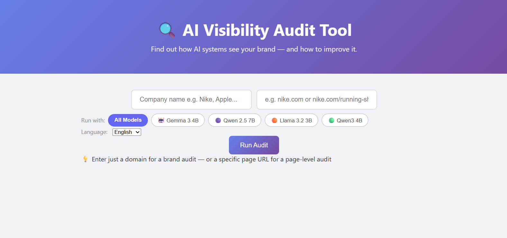

# Customer Support AI Pipeline

This project contains a customer support AI pipeline built around a notebook-based workflow. It uses LLM tooling and provider configuration to classify support tickets, evaluate responses, and explore customer support automation.



## Project structure

- `CSC.ipynb` - main analysis and pipeline notebook.
- `config.json` - primary provider and evaluation configuration.
- `config/config.json` - application configuration folder for provider settings and labels.
- `data/transcripts.csv` - support transcript dataset.
- `requirements.txt` - Python dependencies.

## What this project does

- Defines AI provider settings for OpenAI, Gemini, Ollama, and OpenRouter.
- Includes classification labels such as `billing`, `claims`, `complaint`, and `general_query`.
- Includes evaluation criteria such as `tone_empathy`, `knowledge_accuracy`, and `resolution_quality`.
- Uses notebook-driven experimentation for customer support workflows.

## Setup

1. Create and activate a virtual environment:

```powershell
python -m venv myenv
myenv\Scripts\Activate.ps1
```

2. Install dependencies:

```powershell
pip install -r requirements.txt
```

3. Add your environment variables to `.env`.

4. Open `CSC.ipynb` in Jupyter or VS Code and run the notebook cells.

## Configuration

The top-level `config.json` contains the provider configuration and model settings for different platforms:

- `provider`: selected provider name
- `openai`, `gemini`, `ollama`, `openrouter`: model settings and generation parameters
- `classification.labels`: supported customer support categories
- `evaluation.criteria`: evaluation metrics and scoring range

